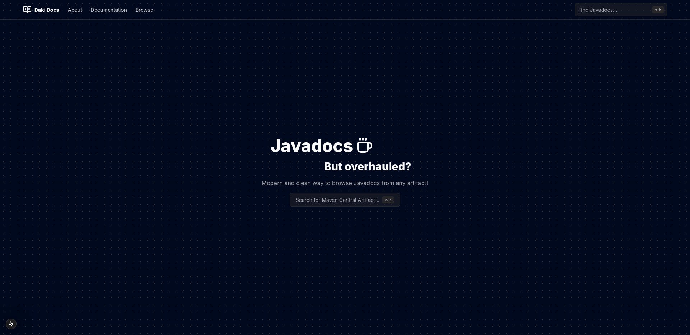
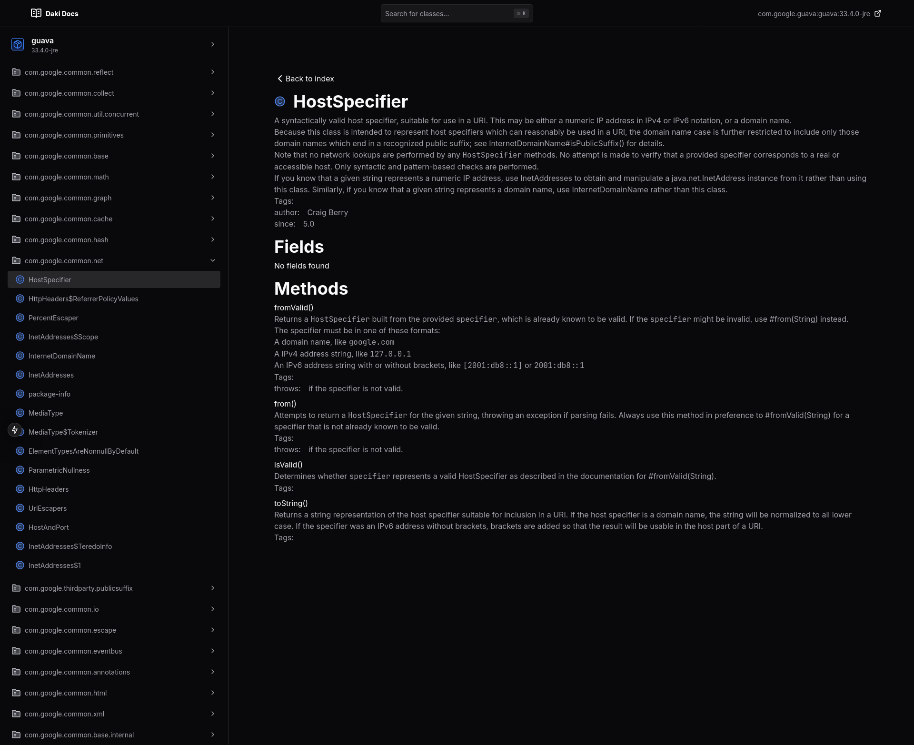

# Daki Doc

Daki Doc is an experimental documentation parser for Maven Central-based artifacts.

> [!WARNING]  
> This project is in a highly experimental state and is not recommended for production use.
> There are no loading indicators, so please be patient when loading the documentation.

## License

Licensed under the MIT License. See [LICENSE](LICENSE) for more information.